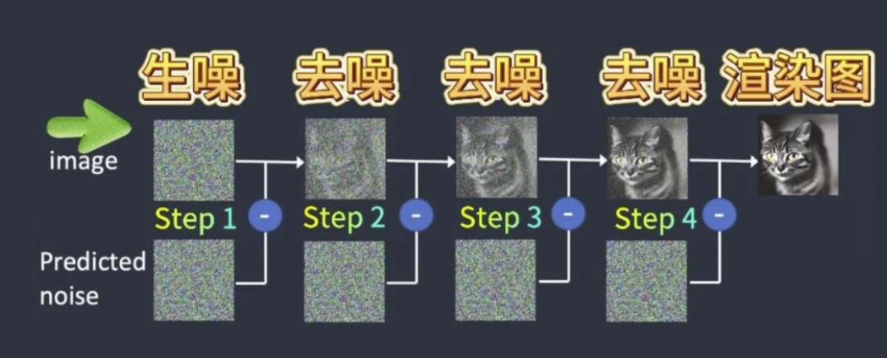
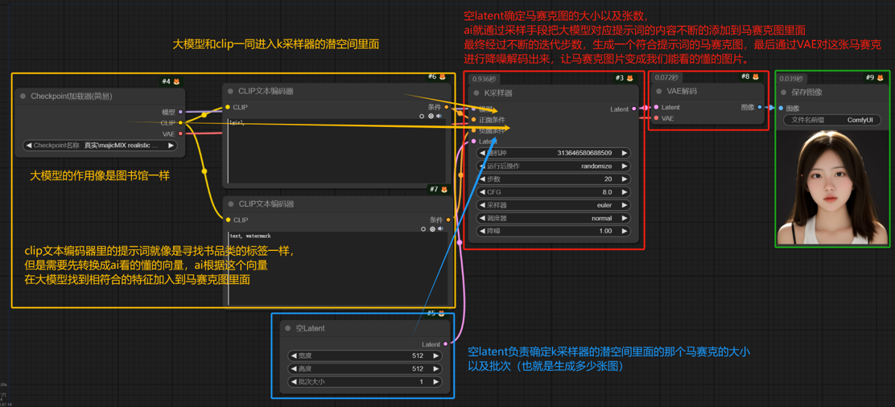

## 概况

之前寒假的时候报了一个辅导班，学习WebUI和ComfyUI的一些知识，但是由于我太怠惰了，以及本地没部署下模型来等等原因，没有进行这方面的学习。。。

29号伟大滴站chang古宇恒先生和杜文韬先生帮我把电脑搬到了58工坊，我的模型也基本完全下好了，我痛定思痛，决定从现在开始学习学习学习

于是就有了本篇博客，记录我的学习过程，同时也给看到这篇博客的大家分享一下我学到的东西。

## 原理

>这里仅仅对原理进行简单的介绍，具体的原理会在后面再具体学习，现在仅仅对应用层进行学习

SD模型即Stable Diffusion（稳定扩散）模型，是一种基于深度学习的从文本到图像的模型，WebUI和ComfyUI是两种不同的交互界面，用来和SD模型进行交互

    在大模型训练过程中有这几步：
    1：创建了一个叫做潜在空间的地方 Latent space（潜空间）。
    
    2：用算法把这些图片进行压缩，并高度总结图片的特征，图片保留特征并且压缩成了特征的马赛克，这个过程我们称之为加噪音，特征马赛克也称之为噪音。
    
    3：同时stable diffusion对文本的Tag也进行了总结和压缩，这个过程，称之为Token化。所谓的Token化，就是把文字拆解成小的单位，然后形成各种方便计算机可以理解但是人无法理解的字符字母和符号。
    
    用于方便计算机用非常神奇的算法进行各种的匹配，再把图片特征进行总结和压缩，并且把文本tag也进行token化的同时，stable diffusion还依然让图片和Tag保持起对应的关系，但此时就不是图片对应Tag了，而是潜在空间中Latent Space中的特征马赛克和他Token对应的这种关系
    
    这时候我们就得到了一个懂得非常多的文本和图片的特征的对应关系的大模型。通过大模型可以创建潜在空间latent space。潜在空间里面存放的都是马赛克和文本token的对应关系，这个计算的过程一般称之为训练大模型。
    
在生成图像的时候，会先在潜空间生成一个噪声图，然后不断地对噪声图进行去噪或添加噪点（以去噪为主，添加噪点仅仅是用来丰富细节），最终得到成品的图像，把噪声图保存为正常的图像

相较于WebUI，ComfyUI自由度更高一点

## WebUI

## ComfyUI

### 01-ComfyUI的基础入门（文生图）

#### 文生图入门

由原理知，生成图像的流程应该是

Clip文本编码把prompt翻译成大模型能看懂的语言 --> 大模型提供噪声图 --> 放到潜空间Latent --> K采样器降噪 --> VAE解码 --> 保存图片

#### 添加了LoRA的文生图

但是，大模型的Tag太多了，没有办法精细控制每个风格和人物，同时大模型又不能无限大，存下所有风格和人物的Tag，所以我们就引入了LoRA来精细控制风格和人物

添加了LoRA之后我们原来的“大模型”模块就变成了“大模型+LoRA模型”模块，这里可以给LoRA看做大模型的一部分，于是很简单地我们就可以得出加入LoRA的文生图工作流是什么样子的

### 02-ComfyUI的图生图、重绘与放大

图生图的原理和文生图的原理类似，前面我们提到过文生图是由大模型根据clip提供噪声图然后发到latent中，而在图生图中是由大模型根据clip和已经存在的latent在上面再一定程度的添加噪声，然后生成图片

我们知道VAE是解码器，但是我们不知道的是VAE其实是可以反过来用的，它也可以把已经存在的图像编码为Latent图像，然后再发送给K采样器，与大模型的噪声结合等等

而这个编码的Latent图像由于它是根据原有的图像编码的，所以它的噪声就可以理解为是原来的图像的样子，因此你对这个噪声图的降噪越高，它对原来的图像的样子的去噪就越高，也就越不接近于原图

而ComfyUI就是基于这个来进行图生图、图像的重绘与放大的